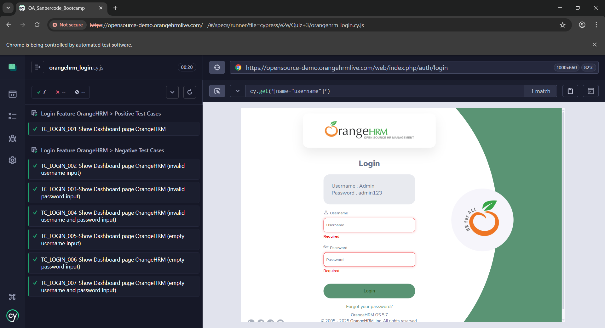
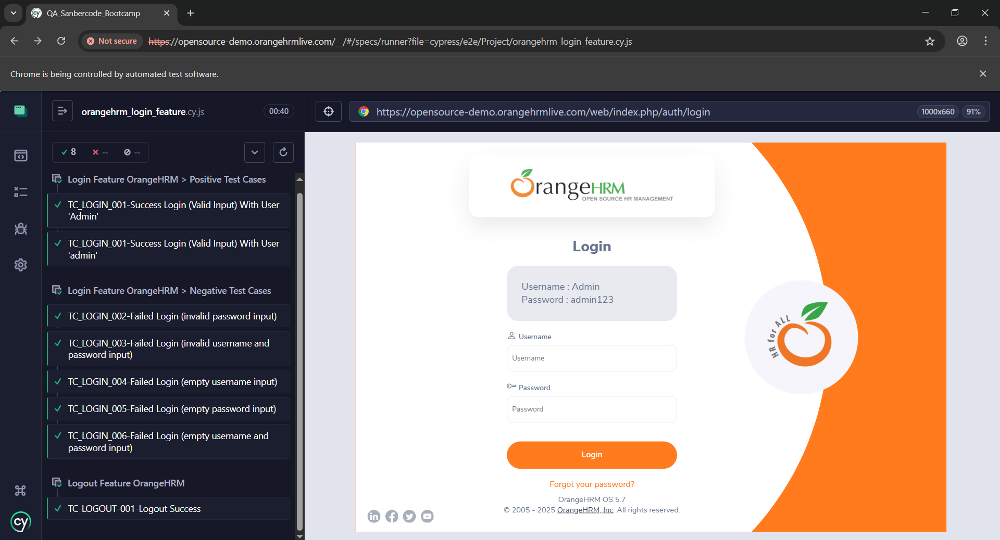

# QA_Sanbercode_Bootcamp


## 📑 Table of Contents

-   🏠 [About the Project](#qa_sanbercode_bootcamp)
-   📝 [Introduction](#introduction)
-   🎯 [Purpose](#purpose)
-   📂 [Repository Contents](#repository-contents)
-   🚫 [Not Included](#not-included)
-   ⚙️ [Installation](#installation)
-   🌳 [Files Tree of Cypress Folder](#files-tree-of-cypress-folder)
    -   📝 [Quiz 3 Files tree](#quiz-3-files-tree)
    -   🔗 [Reqres.in API Files tree](#reqresin-api-files-tree)
    -   📊 [Project Files tree](#project-files-tree)
-   📸 [Screenshots Test Result](#screenshots-test-result)
    -   🧪 [Quiz 3](#quiz-3)
    -   🖥️ [Project](#project)

## Introduction

Quiz and Project files that use Cypress for Website Automation Testing. This project used **[Cypress ver 15.0.0](https://docs.cypress.io/app/references/changelog#15-0-0)**.
This cypress project consists of 3 project including Quiz 3 from bootcamp, Reqres.in Free API testing, and Project that using OrangeHRM open source website for testing the Login, Forgot Password, and Dashboard (Directory) features.

## Purpose

This project was built as part of the Sanbercode QA Bootcamp.
It demonstrates skills in:

-   Writing end-to-end tests with Cypress
-   Organizing tests using fixtures and support files
-   Testing both UI (OrangeHRM website) and API (Reqres.in)

## Repository Contents

This repository contains:

-   `cypress/` → Cypress tests (quiz & project files)
-   `cypress.env.json`→ Contains env for testing
-   `package.json` → Project dependencies & scripts
-   `screenshots` → Contains screenshot of the testing result
-   `.gitignore` → Configuration to ignore unnecessary files (e.g. `node_modules`)

## Not Included

-   `node_modules/` is not included in this repository to keep the repo size small.
    You must install it locally after cloning.

## Installation

Clone the repo (if you use bash):

```bash
git clone https://github.com/AlvinGary/QA_Sanbercode_Bootcamp.git
cd QA_Sanbercode_Bootcamp
```

Install Dependencies:

```bash
npm install
```

## Files Tree of Cypress Folder

if you want to check or run the test, there is the folder and files that you need to check:

-   **e2e** files is for testing in the cypress from selected browser. This file used for running the test. (.cy.js)
-   **fixtures** files is for inserting the data used. this data in raw json format. (.json)
-   **support** files is for separate the logic from the cy.js file to help shorten also clean the code in the testing files so that it more readable. (.js)

Make sure check the files and folder correctly if clone the project, so that you know the related files between folders. Below is the complete and separate files tree to help you know the complete and the specific test folder.

```
└── 📁cypress
    └── 📁e2e
        └── 📁Project
            ├── orangehrm_directory_feature.cy.js
            ├── orangehrm_forgot_pass_feature.cy.js
            ├── orangehrm_login_feature.cy.js
        └── 📁Quiz 3
            ├── quiz_orangehrm_login.cy.js
        └── 📁Reqres.in test
            ├── reqres_api_auth.cy.js
            ├── reqres_api_users.cy.js
        ├── test.cy.js
    └── 📁fixtures
        └── 📁orangehrm_data
            └── 📁project_data
                ├── orangehrm_directory_data.json
                ├── orangehrm_login_data.json
            └── 📁quiz3_data
                ├── quiz3_orangehrm_login_data.json
        └── 📁reqres.in_data
            ├── reqres_auth_data.json
            ├── reqres_users_data.json
        ├── example.json
    └── 📁support
        └── 📁project_support
            ├── orangehrm_directory_support.js
            ├── orangehrm_forgot_pass_support.js
            ├── orangehrm_login_support.js
        └── 📁quiz3_support
            ├── quiz3_orangehrm_login_page.js
        └── 📁reqres.in_support
            └── 📁api
                ├── reqres_auth_api.js
                ├── reqres_users_api.js
        ├── commands.js
        └── e2e.js
```

### Quiz 3 Files tree

```
e2e
└── 📁cypress
    └── 📁e2e
        └── 📁Quiz 3
            ├── quiz_orangehrm_login.cy.js
    └── 📁fixtures
        └── 📁orangehrm_data
            └── 📁quiz3_data
                ├── quiz3_orangehrm_login_data.json
    └── 📁support
        └── 📁quiz3_support
            ├── quiz3_orangehrm_login_page.js
```

### Reqres.in API Files tree

```
e2e
└── 📁cypress
    └── 📁e2e
        └── 📁Reqres.in test
            ├── reqres_api_auth.cy.js
            ├── reqres_api_users.cy.js
    └── 📁fixtures
        └── 📁reqres.in_data
            ├── reqres_auth_data.json
            ├── reqres_users_data.json
    └── 📁support
        └── 📁reqres.in_support
            └── 📁api
                ├── reqres_auth_api.js
                ├── reqres_users_api.js
```

### Project Files tree

```
e2e
└── 📁cypress
    └── 📁e2e
        └── 📁Project
            ├── orangehrm_directory_feature.cy.js
            ├── orangehrm_forgot_pass_feature.cy.js
            ├── orangehrm_login_feature.cy.js
    └── 📁fixtures
        └── 📁orangehrm_data
            └── 📁project_data
                ├── orangehrm_directory_data.json
                ├── orangehrm_login_data.json
    └── 📁support
        └── 📁project_support
            ├── orangehrm_directory_support.js
            ├── orangehrm_forgot_pass_support.js
            ├── orangehrm_login_support.js
```

## Screenshots Test Result

Here is an example of a successful running test:

### Quiz 3



### Project




